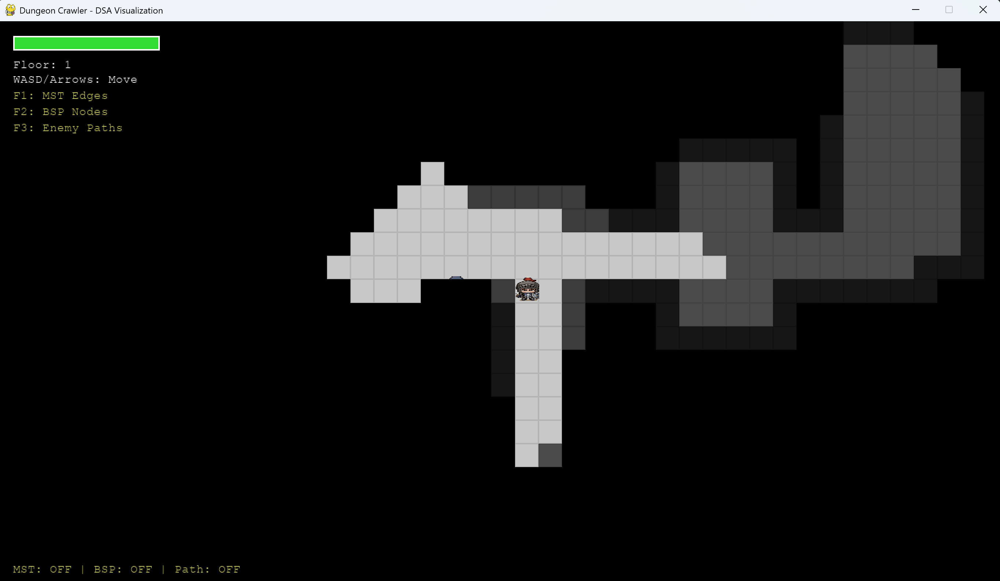
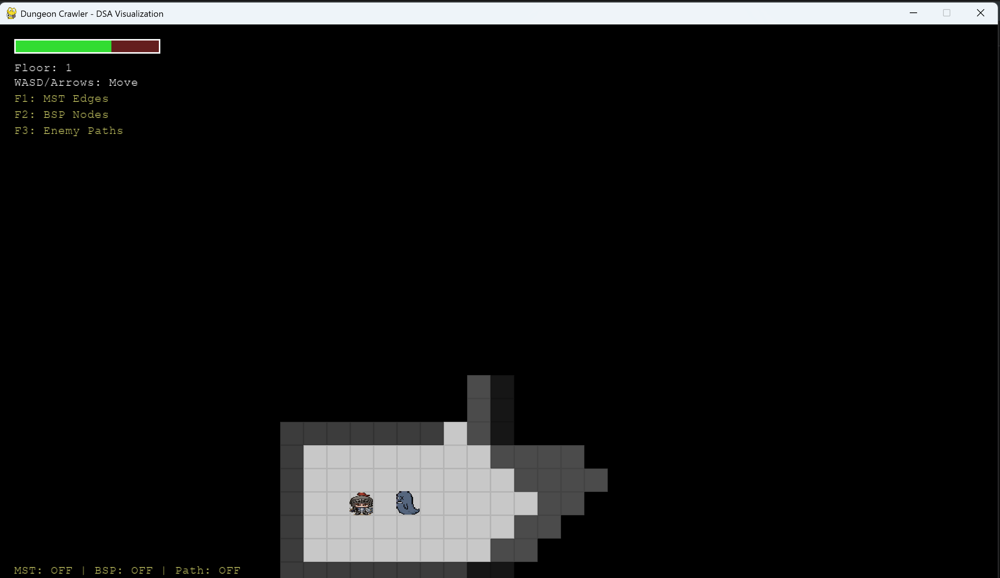
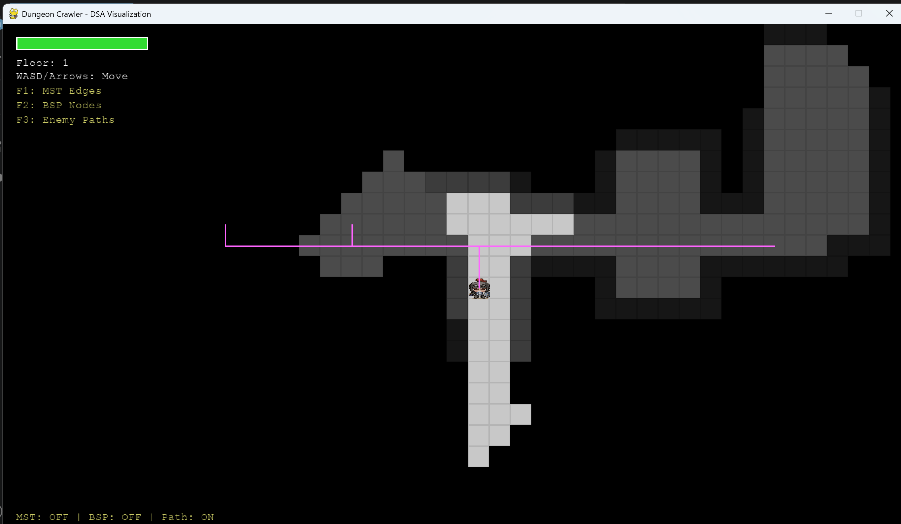

# BÁO CÁO ĐỒ ÁN MÔN HỌC

## Đồ án phát triển ứng dụng — Cấu trúc Dữ liệu và Giải thuật

**Lớp:** IT003.Q21.CTTN  
**Mã sinh viên:** 25520957  
**Họ và tên:** Nguyễn Tuấn Kiệt  
**Năm học:** 2025–2026

---

## TÊN ĐỀ TÀI: **DUNGEON CRAWLER 2D — Procedural Map Generation & DSA Visualization**

*Game nhập vai góc nhìn từ trên xuống với hệ thống sinh bản đồ tự động hoàn toàn bằng các cấu trúc dữ liệu và giải thuật nền tảng.*

---

## 1. GIỚI THIỆU ĐỒ ÁN

### 1a. Mô tả chung về ứng dụng

**Dungeon Crawler 2D** là một game nhập vai (RPG) góc nhìn từ trên xuống (top-down) được xây dựng bằng ngôn ngữ **Python** và thư viện đồ họa **Pygame 2.6**. Điểm cốt lõi của đồ án là mỗi khi người chơi bắt đầu một màn chơi mới, **100% bản đồ được máy tính tự động sinh ra** qua một pipeline gồm nhiều thuật toán hoạt động phối hợp với nhau. Không có bản đồ nào giống nhau — mỗi lần chơi là một trải nghiệm hoàn toàn mới.

**Các chức năng chính của ứng dụng:**

| Chức năng                          | Mô tả                                                              |
| ---------------------------------- | ------------------------------------------------------------------ |
| **Sinh bản đồ tự động**            | Sử dụng BSP Tree để tạo phòng, Kruskal MST để nối hành lang        |
| **Điều khiển người chơi**          | WASD / Phím mũi tên để di chuyển trong mê cung                     |
| **Quái vật AI**                    | Enemy dùng A* Pathfinding để truy đuổi người chơi                  |
| **Hệ thống tầm nhìn (Fog of War)** | BFS kết hợp Raycasting (Bresenham) — vùng tối dần theo khoảng cách |
| **Hệ thống máu & mạng**            | 3 máu, bất tử 1 giây sau khi bị đòn                                |
| **Cầu thang qua tầng**             | Đi đến cầu thang để sang tầng mới với bản đồ khó hơn               |
| **Chế độ Debug trực quan**         | F1: vẽ MST, F2: vẽ BSP, F3: vẽ đường đi A*                         |
| **Permadeath**                     | Chết là mất hết — nhấn R để chơi lại                               |

**Công nghệ sử dụng:**

- **Python 3.14+** — ngôn ngữ lập trình chính
- **Pygame 2.6.1** — thư viện đồ họa, xử lý input, âm thanh
- **heapq** — thư viện chuẩn: hàng đợi ưu tiên (Priority Queue / Min-Heap) cho A*
- **math** — tính khoảng cách Euclidean, hỗ trợ di chuyển mượt (pixel-based)
- **random** — sinh số ngẫu nhiên cho BSP split, spawn, vòng lặp MST
- **pygame.Rect** — cấu trúc hình chữ nhật dùng cho BSP node, phòng, va chạm

**Cách cài đặt & chạy:**

```bash
pip install pygame
python main.py
```

Hoặc dùng script `run.sh` (tự động cài pygame nếu chưa có).

---

### 1b. Các CTDL và Giải thuật đã sử dụng

Phần này trình bày chi tiết từng cấu trúc dữ liệu và giải thuật, trả lời hai câu hỏi: **WHAT** (nó là gì?) và **WHY** (tại sao chọn nó?).

---

#### 1. **Binary Space Partitioning — BSP Tree (Cây phân vùng nhị phân)**

**WHAT — Định nghĩa:**

BSP Tree là cấu trúc dữ liệu dạng cây nhị phân dùng để phân chia một không gian (bản đồ) thành các vùng con hình chữ nhật không chồng lấn.

```
class BSPNode:
    rect: pygame.Rect      # vùng không gian node quản lý
    left: BSPNode | None   # node con trái
    right: BSPNode | None  # node con phải
    room: pygame.Rect | None # căn phòng (chỉ node lá mới có)
```

**Cơ chế hoạt động:**
1. Bắt đầu: toàn bộ màn hình là node gốc (root).
2. Đệ quy: mỗi node được *split* (cắt) thành 2 node con bằng một đường cắt ngang hoặc dọc ở vị trí ngẫu nhiên.
3. Điều kiện dừng: khi node quá nhỏ (< 7 ô) hoặc đạt độ sâu tối đa (depth = 6).
4. Node lá: sau khi split xong, mỗi node lá tự tạo một căn *phòng ngẫu nhiên* bên trong vùng của nó với padding 1 ô.

**Độ phức tạp:**
- Split: O(1) mỗi node
- create_room(): O(1) mỗi node lá
- get_leaves(): O(n) với n là số node
- **Tổng xây dựng cây:** O(2^depth) ≈ O(n)

**WHY — Tại sao chọn BSP?**

| Tiêu chí                 | Lý do                                                                                |
| ------------------------ | ------------------------------------------------------------------------------------ |
| **Tự nhiên**             | Phân vùng không gian kiểu "phòng trong phòng" tạo bố cục giống dungeon thật          |
| **Không chồng lấn**      | BSP đảm bảo các phòng không bao giờ đè lên nhau (khác với sinh ngẫu nhiên thuần túy) |
| **Kiểm soát kích thước** | Có thể dễ dàng điều chỉnh độ rộng/hẹp của phòng qua min_size                         |
| **Cây tự nhiên**         | Cấu trúc cây giúp dễ dàng debug, duyệt, và mở rộng (thêm hành lang, vật phẩm...)     |
| **Nhanh**                | O(n) với n ~ 100 nodes — chạy ngay lập tức                                           |

**Phân tích so với giải pháp khác:**
- *Cellular Automata*: Tạo hang động tự nhiên hơn nhưng khó kiểm soát kích thước phòng, dễ tạo đường đi không mong muốn.
- *Random Room Placement*: Đơn giản nhưng phòng có thể chồng lấn, cần thêm bước xử lý va chạm (separation).
- *Dungeon Generator (Drunkard Walk)*: Tạo đường đi ngẫu nhiên — thú vị cho hang động nhưng không tạo được phòng rõ ràng.

**Kết luận:** BSP là lựa chọn tối ưu cho dungeon có cấu trúc phòng rõ ràng, dễ mở rộng và kiểm soát.

---

#### 2. **Đồ thị vô hướng có trọng số (Graph)**

**WHAT — Định nghĩa:**

Đồ thị (Graph) là cấu trúc dữ liệu gồm tập hợp các **đỉnh (vertex)** và các **cạnh (edge)** nối giữa chúng. Trong đồ án:

```
class Graph:
    vertices: dict[int, (float, float)]  # id → (x, y) tâm phòng
    edges: list[(int, int, float)]        # (v1, v2, weight)
```

- **Đỉnh:** là tâm (center) của mỗi căn phòng.
- **Cạnh:** nối giữa mọi cặp đỉnh, trọng số là khoảng cách Euclidean.
- **Loại đồ thị:** Đồ thị **đầy đủ** (Complete Graph) — mọi cặp đỉnh đều có cạnh nối.

**Xây dựng đồ thị đầy đủ từ danh sách phòng:**

```python
for i in range(V):
    for j in range(i + 1, V):
        dist = sqrt((x1-x2)^2 + (y1-y2)^2)
        add_edge(i, j, dist)
```

**Độ phức tạp:** O(V²) — với V là số phòng (thường 15–25).

**WHY — Tại sao chọn Complete Graph?**

| Tiêu chí             | Lý do                                                                 |
| -------------------- | --------------------------------------------------------------------- |
| **Đầy đủ thông tin** | Chỉ có đồ thị đầy đủ mới cho phép Kruskal chọn ra V-1 cạnh tốt nhất   |
| **MST cần so sánh**  | Thuật toán Kruskal cần xem xét *tất cả* các cặp để tìm cạnh ngắn nhất |
| **Đơn giản**         | Implement rõ ràng, dễ hiểu, dễ debug                                  |
| **Số phòng nhỏ**     | V ≤ 30 → V² ≤ 900 → hoàn toàn chấp nhận được về hiệu năng             |

**Phân tích so với giải pháp khác:**
- *Đồ thị thưa (Sparse Graph)*: Tiết kiệm bộ nhớ hơn nhưng Kruskal không thể đảm bảo tìm được MST tối ưu.
- *Delaunay Triangulation*: Giảm số cạnh xuống O(V) nhưng phức tạp hơn nhiều, không cần thiết với V nhỏ.

---

#### 3. **Disjoint Set (Union-Find)**

**WHAT — Định nghĩa:**

Disjoint Set (còn gọi là Union-Find) là cấu trúc dữ liệu quản lý các **tập hợp không giao nhau** (disjoint sets). Hỗ trợ hai thao tác chính:

```
class UnionFind:
    parent: list[int]   # parent[i] = cha của i
    rank: list[int]     # rank[i] = độ cao cây gốc i
```

- **find(x):** Tìm gốc (root) của tập chứa x. Sử dụng *Path Compression*.
- **union(x, y):** Hợp nhất 2 tập chứa x và y. Sử dụng *Union by Rank*.

**Độ phức tạp:** O(α(n)) với α là hàm Ackermann ngược — **gần như O(1)** amortized.

**WHY — Tại sao chọn Union-Find?**

| Tiêu chí                | Lý do                                                                                |
| ----------------------- | ------------------------------------------------------------------------------------ |
| **Tốc độ**              | α(n) ≤ 5 với mọi n trong thực tế → runtime gần như O(1)                              |
| **Phát hiện chu trình** | Là công cụ chuẩn trong Kruskal: nếu find(v1) == find(v2) thì thêm cạnh tạo chu trình |
| **Kết hợp nhanh**       | union() chỉ mất O(α(n)) — cực kỳ hiệu quả                                            |

**Path Compression vs Union by Rank:**

| Kỹ thuật             | Tác dụng                                                              | Minh họa                                     |
| -------------------- | --------------------------------------------------------------------- | -------------------------------------------- |
| **Path Compression** | Trong find(), gán trực tiếp parent của mọi node trên đường đi về root | `self.parent[x] = self.find(self.parent[x])` |
| **Union by Rank**    | Gắn cây có rank thấp vào cây có rank cao — giữ cây cân bằng           | So sánh rank[rx] và rank[ry]                 |

Hai kỹ thuật này kết hợp đảm bảo độ phức tạp O(α(n)) — một trong những kết quả kinh điển nhất của khoa học máy tính.

**Phân tích so với giải pháp khác:**
- *DFS Cycle Detection*: O(V + E) mỗi lần thêm cạnh — chậm hơn nhiều so với O(α(n)) của Union-Find.
- *Set-based (Python set)*: Không hỗ trợ union hiệu quả — phải tạo set mới mỗi lần.

---

#### 4. **Minimum Spanning Tree — Kruskal (Cây khung nhỏ nhất)**

**WHAT — Định nghĩa:**

MST (Minimum Spanning Tree) của một đồ thị vô hướng có trọng số là tập hợp **V-1 cạnh** nối tất cả V đỉnh với **tổng trọng số nhỏ nhất**.

**Thuật toán Kruskal — các bước:**

```
Bước 1: Sắp xếp tất cả cạnh theo trọng số tăng dần.    → O(E log E)
Bước 2: Khởi tạo Union-Find với V phần tử.              → O(V)
Bước 3: Duyệt từng cạnh (từ nhỏ đến lớn):               → O(E * α(V))
    Nếu find(v1) ≠ find(v2):                            → không tạo chu trình
        union(v1, v2) → thêm cạnh vào MST
    Ngược lại: → bỏ qua (sẽ gây chu trình)
```

**Cải tiến: Thêm Loop**

Sau khi tìm MST, 10% số cạnh bị loại được thêm lại ngẫu nhiên. Điều này tạo *vòng lặp* (loop) trong bản đồ, giúp:

- Người chơi có nhiều đường đi hơn (không bị dạng cây đơn điệu)
- Quái vật có nhiều hướng tiếp cận hơn
- Bản đồ trông "tự nhiên" hơn

**Độ phức tạp:**
- **O(E log V)** — sắp xếp cạnh là bước tốn kém nhất
- Với V = 20, E = 190 → chạy ngay lập tức

**WHY — Tại sao chọn Kruskal?**

| Tiêu chí               | Lý do                                                        |
| ---------------------- | ------------------------------------------------------------ |
| **Tối ưu toàn cục**    | Đảm bảo tổng chiều dài hành lang là ngắn nhất                |
| **Không chu trình**    | Đảm bảo mọi phòng đều được kết nối nhưng không có đường thừa |
| **Kết hợp Union-Find** | Dễ implement, dễ hiểu, dễ debug                              |
| **Có thể mở rộng**     | Thêm loop dễ dàng — chỉ cần thêm lại cạnh loại bỏ            |

**Phân tích so với giải pháp khác:**

| Thuật toán  | Ưu điểm                                       | Nhược điểm                           | Kết luận                                    |
| ----------- | --------------------------------------------- | ------------------------------------ | ------------------------------------------- |
| **Kruskal** | O(E log V), đơn giản, song song hóa được      | Cần sắp xếp E cạnh                   | **Chọn** — phù hợp với đồ thị đầy đủ E = V² |
| **Prim**    | O(E log V) dùng heap, hiệu quả với đồ thị dày | Khó song song, phức tạp hơn một chút | Cũng tốt nhưng Kruskal trực quan hơn        |
| **Borůvka** | O(E log V), song song tốt                     | Phức tạp nhất                        | Không cần thiết                             |

---

#### 5. **A* Pathfinding — Thuật toán tìm đường**

**WHAT — Định nghĩa:**

A* (A-Star) là thuật toán tìm đường đi ngắn nhất trên đồ thị có trọng số, sử dụng **hàm đánh giá (evaluation function)**:

```
f(n) = g(n) + h(n)
```

- **g(n):** chi phí thực tế từ điểm bắt đầu đến node n
- **h(n):** heuristic — ước lượng chi phí từ node n đến đích
- **f(n):** tổng chi phí ước lượng

**Cấu trúc dữ liệu chính:**

```
open_set: Min-Heap (priority queue)   → chứa các node cần xét
           (f_score, counter, (x, y))
came_from: dict                        → truy vết đường đi
g_score: dict                          → chi phí ngắn nhất đã biết đến node
f_score: dict                          → g(n) + h(n)
```

**Heuristic — Khoảng cách Manhattan:**

```python
h(n) = |x1 - x2| + |y1 - y2|
```

- **Admissible** (chấp nhận được): không bao giờ đánh giá quá cao chi phí thực tế
- **Consistent** (nhất quán): thỏa mãn bất đẳng thức tam giác
- **Ưu điểm:** O(1) tính toán, đơn giản, hiệu quả với lưới 4 hướng

**Tối ưu hóa trong đồ án:**

| Tối ưu                        | Chi tiết                          | Tác dụng                                   |
| ----------------------------- | --------------------------------- | ------------------------------------------ |
| **Giới hạn node**             | max_nodes = 500                   | Tránh treo game nếu không tìm thấy đường   |
| **Tính lại theo thời gian**   | Mỗi 150ms (ENEMY_RECALC_INTERVAL) | Giảm CPU — không tính A* mỗi frame         |
| **Tính lại theo khoảng cách** | Khi player di chuyển > 2 tiles    | Đảm bảo đường đi luôn "fresh"              |
| **Chọn Chaser**               | Chỉ 3 enemy gần nhất dùng A*      | Tiết kiệm CPU — các enemy xa đi lang thang |

**Độ phức tạp:** O(N log N) với N là số ô lưới được duyệt.

**WHY — Tại sao chọn A*?**

| Tiêu chí                | Lý do                                                              |
| ----------------------- | ------------------------------------------------------------------ |
| **Tối ưu (Optimal)**    | A* luôn tìm đường ngắn nhất nếu heuristic admissible               |
| **Hiệu quả**            | Nhanh hơn Dijkstra (không có heuristic) và BFS (không có trọng số) |
| **Heuristic hướng dẫn** | Manhattan giúp A* "đi đúng hướng" — ít duyệt node hơn              |
| **Phù hợp lưới**        | A* hoạt động tốt trên grid-based map                               |

**So sánh với các thuật toán tìm đường khác:**

| Thuật toán            | Heuristic?  | Tối ưu?       | Độ phức tạp              | Phù hợp?                        |
| --------------------- | ----------- | ------------- | ------------------------ | ------------------------------- |
| **A***                | Có          | Có            | O(N log N)               | **Chọn**                        |
| **Dijkstra**          | Không (h=0) | Có            | O(N log N) — chậm hơn A* | Không heuristic → lãng phí      |
| **BFS**               | Không       | Có (lưới đều) | O(N) — nhanh nhất        | Chỉ dùng cho Fog of War         |
| **Greedy Best-First** | Có          | Không         | O(N) — rất nhanh         | Có thể bỏ qua đường tối ưu      |
| **Jump Point Search** | Có          | Có            | O(N)                     | Phức tạp, yêu cầu grid đặc biệt |

---

#### 6. **BFS (Breadth-First Search) + Raycasting — Fog of War**

**WHAT — Định nghĩa:**

Fog of War (FOW) là hệ thống mô phỏng tầm nhìn hạn chế của người chơi. Trong đồ án:

- **BFS (Loang):** Duyệt các ô sàn trong bán kính FOV_RADIUS từ người chơi
- **Raycasting (Bresenham):** Kiểm tra tia nhìn từ player đến từng ô

**Ba trạng thái của mỗi ô:**

| Trạng thái   | Màu                             | Ý nghĩa                              |
| ------------ | ------------------------------- | ------------------------------------ |
| **Visible**  | Trong suốt                      | Đang trong tầm nhìn — vẽ bình thường |
| **Explored** | Tối mờ (RGBA: 0,0,0,160)        | Đã thấy trước đây — vẽ mờ            |
| **Hidden**   | Đen hoàn toàn (RGBA: 0,0,0,255) | Chưa từng thấy — không vẽ gì cả      |

**BFS — Cơ chế loang:**

```
Khởi tạo queue với vị trí player
while queue:
    pop (x, y, dist)
    if dist > FOV_RADIUS: continue
    if có tia nhìn: đánh dấu visible & explored
    Thêm 4 ô lân cận vào queue
```

- BFS đảm bảo duyệt theo thứ tự khoảng cách — các ô gần được xử lý trước.
- BFS trên grid tương đương với Dijkstra với trọng số đơn vị.

**Raycasting — Thuật toán Bresenham:**

```
dx = abs(x1 - x0), dy = -abs(y1 - y0)
sx = 1 nếu x0 < x1, -1 nếu ngược lại
sy = 1 nếu y0 < y1, -1 nếu ngược lại
err = dx + dy

while True:
    if (cx, cy) == (x1, y1): return True  # đến đích → có tia nhìn
    if grid[cy][cx] == WALL: return False  # gặp tường → không có tia nhìn
    cập nhật err và bước tiếp theo
```

- Bresenham chỉ dùng **số nguyên** (integer arithmetic) — không floating-point → rất nhanh.
- Mỗi tia kiểm tra tối đa R ô (R = FOV_RADIUS).

**Độ phức tạp tổng thể:**
- BFS: O(R²) ô được duyệt
- Raycasting: O(R) mỗi ô
- **Tổng: O(R³) ≈ O(512) với R=8** — chạy rất nhanh

**WHY — Tại sao chọn BFS + Raycasting?**

| Tiêu chí             | Lý do                                                                |
| -------------------- | -------------------------------------------------------------------- |
| **Chính xác**        | Bresenham kiểm tra tia chính xác đến từng pixel — không bỏ sót tường |
| **Hiệu quả**         | Integer arithmetic — không floating point → rất nhanh                |
| **Không precompute** | Tính toán real-time mỗi frame — không cần bộ nhớ đệm                 |
| **BFS tự nhiên**     | Loang từ player, ưu tiên ô gần trước — đúng logic tầm nhìn           |

**So sánh với giải pháp khác:**

| Giải pháp                      | Ưu điểm                    | Nhược điểm               |
| ------------------------------ | -------------------------- | ------------------------ |
| **BFS + Raycast** (chọn)       | Chính xác, đơn giản, nhanh | O(R³) lý thuyết          |
| **Pre-computed Shadow Volume** | Rất nhanh (O(R²))          | Phức tạp, cần precompute |
| **Recursive Shadowcasting**    | Rất nhanh                  | Sai sót với tường mỏng   |
| **Simple LOS check**           | Cực nhanh (O(R))           | Thiếu chính xác, sót ô   |

---

#### 7. **Hàng đợi ưu tiên — Priority Queue (Min-Heap)**

**WHAT — Định nghĩa:**

Priority Queue là CTDL cho phép truy xuất phần tử có **độ ưu tiên cao nhất** (trong A*: f(n) nhỏ nhất) trong O(log N).

Trong Python, sử dụng module **heapq**:

```python
heapq.heappush(heap, (priority, counter, item))  # O(log N)
heapq.heappop(heap)                               # O(log N)
```

**Counter** được thêm vào để tránh so sánh tuple không cần thiết khi 2 node có cùng f(n).

**WHY — Tại sao chọn heap?**

| Lý do              | Giải thích                                                       |
| ------------------ | ---------------------------------------------------------------- |
| **Tốc độ**         | push/pop O(log N) — nhanh hơn nhiều so với sorted list O(N)      |
| **Thư viện chuẩn** | heapq là module chuẩn của Python — không cần cài đặt thêm        |
| **Đơn giản**       | A* cần pop node có f(n) nhỏ nhất → Min-Heap là lựa chọn tự nhiên |

**So sánh:**
- *Sorted List*: insert O(N) — quá chậm với grid lớn.
- *Unsorted List*: pop min O(N) — cũng chậm.
- *Fibonacci Heap*: O(1) insert, O(log N) pop — nhưng phức tạp, overhead lớn.

---

#### Tổng kết độ phức tạp toàn hệ thống

| Giai đoạn            | Thuật toán / CTDL            | Độ phức tạp         | Thời gian thực tế |
| -------------------- | ---------------------------- | ------------------- | ----------------- |
| Sinh phòng           | BSP Tree                     | O(n)                | < 1ms             |
| Xây đồ thị           | Complete Graph               | O(V²)               | < 1ms             |
| Hành lang            | Kruskal MST + Union-Find     | O(E log V)          | < 1ms             |
| Tìm đường            | A* + Min-Heap                | O(N log N)          | ~1–5ms            |
| Tầm nhìn             | BFS + Raycasting (Bresenham) | O(R³)               | < 1ms             |
| **Toàn bộ pipeline** | BSP → Graph → MST → A* → FOW | **O(V² + N log N)** | **~5–10ms**       |

---

## 2. QUÁ TRÌNH THỰC HIỆN

**Tổng thời gian:** 4 tuần

---

### Tuần 1: Nghiên cứu lý thuyết và xây dựng khung nền tảng

**Mục tiêu:** Nắm vững các thuật toán, thiết kế kiến trúc và xây dựng pipeline sinh bản đồ.

| Ngày    | Công việc                                                               | Kết quả                                                                                                                 |
| ------- | ----------------------------------------------------------------------- | ----------------------------------------------------------------------------------------------------------------------- |
| **1–2** | Nghiên cứu BSP Tree: đọc tài liệu, phân tích cách phân vùng không gian. | Hiểu rõ BSP, viết prototype BSPNode và BSPTree.                                                                         |
| **2–3** | Xây dựng module đồ thị (Graph) và Disjoint Set (Union-Find).            | Hoàn thiện Graph (add_vertex, add_edge, build_complete_from_rooms) và UnionFind (find path compression, union by rank). |
| **3–4** | Cài đặt Kruskal MST: sắp xếp cạnh, kiểm tra chu trình, sinh hành lang.  | MST hoạt động, có thể kết nối các phòng bằng đường L-shaped corridor.                                                   |
| **4–5** | Tích hợp BSP → Graph → Kruskal → corridor thành pipeline DungeonMap.    | Pipeline hoàn chỉnh: chỉ cần gọi `dungeon.generate()` là có bản đồ.                                                     |
| **5–6** | Xử lý ngã cụt (dead end removal): lặp xoá ô sàn chỉ có 1 lối vào.       | Bản đồ sạch hơn, không còn ngõ cụt vô nghĩa.                                                                            |
| **6–7** | Thiết lập Pygame: cửa sổ, vòng lặp game, vẽ bản đồ (map rendering).     | Game hiển thị được bản đồ sinh tự động.                                                                                 |

**Kết quả tuần 1:**
- Pipeline sinh bản đồ hoàn chỉnh: BSP → Graph → Kruskal MST → Corridor
- Bản đồ hiển thị được trong cửa sổ Pygame
- Có thể sinh bản đồ mới mỗi lần chạy

**Khó khăn gặp phải:**
1. **BSP split không cân đối:** Ban đầu split hoàn toàn ngẫu nhiên → phòng quá méo. Giải pháp: thêm điều kiện ưu tiên cắt theo chiều dài (nếu w/h > 1.25 → cắt dọc).
2. **Corridor đè lên tường:** Hành lang dài 1 ô → player dễ bị kẹt. Giải pháp: hành lang rộng 2 ô.
3. **Dead end loop vô hạn:** Một số bản đồ dead end removal chạy mãi không dừng. Giải pháp: thêm giới hạn lặp và kiểm tra changed flag.

---

### Tuần 2: Xây dựng Player, Enemy AI và A* Pathfinding

**Mục tiêu:** Phát triển các thực thể trong game và thuật toán tìm đường.

| Ngày      | Công việc                                                                                               | Kết quả                                                                 |
| --------- | ------------------------------------------------------------------------------------------------------- | ----------------------------------------------------------------------- |
| **8–9**   | Xây dựng Player: di chuyển WASD/Arrow, kiểm tra va chạm tường (slide along wall).                       | Player di chuyển mượt trong dungeon.                                    |
| **9–11**  | Cài đặt A* Pathfinding: Min-Heap, Manhattan heuristic, reconstruct path.                                | A* tìm đường chính xác, hiệu quả. Kiểm thử trên nhiều bản đồ khác nhau. |
| **11–13** | Xây dựng Enemy AI: chase mode (dùng A*), wander mode (lang thang ngẫu nhiên), chuyển đổi giữa 2 chế độ. | Enemy truy đuổi người chơi thông minh, biết tìm đường vòng.             |
| **13–14** | Tối ưu Enemy AI: chỉ tính A* mỗi 150ms, chọn 3 enemy gần nhất làm chaser, enemy xa đi lang thang.       | Game chạy 60 FPS ổn định với 5 enemy.                                   |

**Kết quả tuần 2:**
- Player di chuyển mượt, có slide along wall
- A* Pathfinding hoạt động chính xác
- Enemy AI thông minh với 2 chế độ chase/wander

**Khó khăn gặp phải:**
1. **A* chậm khi nhiều enemy:** 5 enemy cùng tính A* mỗi frame → giật. Giải pháp: chỉ tính lại mỗi 150ms, giới hạn max_nodes = 500.
2. **Enemy bị kẹt trong góc:** Thêm stuck detection (nếu enemy không đổi tile trong 500ms → reset path + redirect ngẫu nhiên).
3. **Player bị kẹt ở góc tường:** Implement slide along wall — thử di chuyển từng trục riêng lẻ thay vì cả 2 trục cùng lúc.

---

### Tuần 3: Fog of War, hệ thống chiến đấu và gameplay

**Mục tiêu:** Xây dựng hệ thống tầm nhìn, chiến đấu và các cơ chế gameplay cốt lõi.

| Ngày      | Công việc                                                                                                         | Kết quả                                                                |
| --------- | ----------------------------------------------------------------------------------------------------------------- | ---------------------------------------------------------------------- |
| **15–16** | Hệ thống Fog of War: BFS loang từ player, kiểm tra tia nhìn bằng Bresenham, 3 trạng thái visible/explored/hidden. | Fog of War hoạt động chính xác, không xuyên tường, có hiệu ứng mờ dần. |
| **16–17** | Xử lý va chạm player-enemy (pixel-based collision), hệ thống máu (3 HP), bất tử (invincibility frames 1s).        | Chiến đấu hoạt động ổn định, có feedback khi bị đòn.                   |
| **17–18** | Cầu thang (staircase) và hệ thống tầng (floor progression): mỗi tầng sinh bản đồ mới, tăng số enemy.              | Player có thể đi xuống tầng sâu hơn, độ khó tăng dần.                  |
| **18–19** | Va chạm enemy-enemy: một enemy bị đẩy đi hướng khác khi va chạm, tránh chồng lên nhau.                            | Enemy không còn chồng lên nhau, di chuyển tự nhiên hơn.                |

**Kết quả tuần 3:**
- Fog of War chính xác với 3 trạng thái
- Hệ thống chiến đấu hoàn chỉnh (máu, bất tử, game over)
- Cầu thang và hệ thống tầng
- Enemy-enemy collision

**Khó khăn gặp phải:**
1. **Fog of War bị tường mỏng che:** Bresenham bỏ sót tia khi tường quá mỏng. Giải pháp: điều chỉnh Bresenham để kiểm tra tường tại ô hiện tại (grid[cy][cx]) thay vì ô tiếp theo.
2. **Player bị spawn gần cầu thang:** Cầu thang quá gần → đi sang tầng mới ngay. Giải pháp: kiểm tra khoảng cách, nếu < 10 tiles thì chọn phòng xa nhất.
3. **Nhiều enemy đè lên nhau:** Thiếu enemy-enemy collision. Giải pháp: thêm va chạm pixel giữa các enemy, một enemy bị redirect.

---

### Tuần 4: Debug Visualization, UI, sprite và hoàn thiện

**Mục tiêu:** Thêm công cụ debug trực quan, giao diện người dùng, sprite đồ họa và hoàn thiện tài liệu.

| Ngày      | Công việc                                                                                                     | Kết quả                                                   |
| --------- | ------------------------------------------------------------------------------------------------------------- | --------------------------------------------------------- |
| **20–21** | Chế độ Debug Visualization: F1 (vẽ MST — đường xanh), F2 (vẽ BSP — khung vàng), F3 (vẽ A* path — đường hồng). | Có thể trực quan hoá tất cả thuật toán trong game.        |
| **21–22** | UI: thanh máu (health bar), số tầng (floor counter), hướng dẫn phím tắt, debug status bar.                    | Giao diện người dùng đầy đủ, rõ ràng.                     |
| **22–23** | Thiết kế và tích hợp sprite: nhân vật chính (4 hướng front/back/left/right), ghost enemy (4 hướng).           | Game có đồ họa đẹp hơn, không còn vẽ hình tròn đơn thuần. |
| **23–24** | Màn hình Game Over, nhấn R chơi lại, kiểm tra chuyển tiếp giữa các tầng.                                      | Game loop hoàn chỉnh.                                     |
| **24–25** | Kiểm thử tổng thể: test trên nhiều bản đồ, kiểm tra edge cases, tối ưu hiệu năng.                             | Bug fix, game chạy ổn định 60 FPS.                        |
| **25–28** | Viết summary.md, docstring cho toàn bộ code, viết báo cáo đồ án.                                              | Tài liệu đầy đủ, docstring chi tiết cho mọi class/method. |

**Kết quả tuần 4:**
- Debug Visualization (F1, F2, F3)
- UI thân thiện (thanh máu, số tầng, hướng dẫn)
- Sprite đồ họa cho player và enemy
- Game hoàn chỉnh, sẵn sàng demo
- Tài liệu và báo cáo đầy đủ

**Khó khăn gặp phải:**
1. **Sprite không hiển thị đúng hướng:** Sprite front/back/left/right mapping nhầm với hướng di chuyển. Giải pháp: mapping lại — W→back, S→front, A→left, D→right.
2. **F1/F2/F3 debug không đồng bộ:** Bật nhiều chế độ cùng lúc gây rối màn hình. Giải pháp: thiết kế giao diện debug status bar hiển thị trạng thái bật/tắt.
3. **Test thiếu đa dạng bản đồ:** Một số bản đồ sinh ra không có đường đi. Giải pháp: kiểm tra A* từ player đến cầu thang, nếu không tìm thấy đường thì sinh lại bản đồ.

---

## 3. KẾT QUẢ ĐẠT ĐƯỢC

### 3a. Kết quả định tính

| Tiêu chí                | Đánh giá                                                                                      |
| ----------------------- | --------------------------------------------------------------------------------------------- |
| **Sinh bản đồ tự động** | 100% bản đồ do máy tính sinh — không bản đồ nào giống nhau                                    |
| **Đa dạng thuật toán**  | 6+ CTDL & giải thuật: BSP Tree, Graph, Union-Find, Kruskal MST, A*, BFS, Raycasting, Min-Heap |
| **Enemy AI**            | Quái vật truy đuổi bằng A*, chuyển đổi giữa chase/wander mode                                 |
| **Fog of War**          | Hệ thống tầm nhìn 3 trạng thái (visible/explored/hidden), không xuyên tường                   |
| **Debug Visualization** | 3 chế độ xem trực quan thuật toán (F1, F2, F3)                                                |
| **Gameplay**            | Di chuyển, chiến đấu, máu, bất tử, cầu thang qua tầng, permadeath                             |
| **Hiệu năng**           | 60 FPS ổn định trên phần cứng trung bình                                                      |
| **Code quality**        | Docstring đầy đủ cho mọi class và method, time complexity ghi chú rõ ràng                     |

### 3b. Kết quả định lượng

| Chỉ số                  | Giá trị                                                                                                         |
| ----------------------- | --------------------------------------------------------------------------------------------------------------- |
| **Số dòng code**        | ~1,538 dòng (main.py)                                                                                           |
| **Số class**            | 11 (BSPNode, BSPTree, Graph, UnionFind, KruskalMST, AStar, FogOfWar, DungeonMap, Player, Enemy, DungeonCrawler) |
| **Số method**           | ~50+ (bao gồm cả static method)                                                                                 |
| **Số thuật toán**       | 6+ (BSP, Graph, Union-Find, Kruskal, A*, BFS, Raycasting)                                                       |
| **Số CTDL**             | 5 (Tree, Graph, Disjoint Set, Min-Heap, Grid)                                                                   |
| **FPS mục tiêu**        | 60 FPS                                                                                                          |
| **Kích thước bản đồ**   | 42 × 24 tiles (~1,008 ô)                                                                                        |
| **Số phòng trung bình** | 15–25 phòng                                                                                                     |
| **Số enemy**            | 3–5 enemy mỗi tầng                                                                                              |

### 3c. Các phím tắt và tính năng

| Phím             | Chức năng                                            |
| ---------------- | ---------------------------------------------------- |
| **WASD / Arrow** | Di chuyển người chơi                                 |
| **F1**           | Bật/tắt vẽ cạnh MST (Minimum Spanning Tree)          |
| **F2**           | Bật/tắt vẽ ranh giới BSP (Binary Space Partitioning) |
| **F3**           | Bật/tắt vẽ đường đi A* của quái vật                  |
| **R**            | Chơi lại (khi game over)                             |
| **ESC**          | Thoát game                                           |

---

## 4. TÀI LIỆU THAM KHẢO

### Sách và giáo trình

1. **Cormen, T. H., Leiserson, C. E., Rivest, R. L., & Stein, C. (2022).** *Introduction to Algorithms* (4th ed.). MIT Press.
   - Chương 19: *Disjoint Sets* (Union-Find)
   - Chương 21: *Minimum Spanning Trees* (Kruskal, Prim)
   - Chương 22: *Single-Source Shortest Paths* (Dijkstra)
   - Chương 23: *A\* Search*

2. **Aho, A. V., Hopcroft, J. E., & Ullman, J. D. (1983).** *Data Structures and Algorithms*. Addison-Wesley.
   - Chương 8: *Graph Algorithms*
   - Chương 9: *Minimum Spanning Trees*

3. **Russell, S. & Norvig, P. (2021).** *Artificial Intelligence: A Modern Approach* (4th ed.). Pearson.
   - Chương 3: *Solving Problems by Searching* (A*, Heuristics)
   - Chương 4: *Beyond Classical Search*

4. **Foley, J. D., van Dam, A., Feiner, S. K., & Hughes, J. F. (1995).** *Computer Graphics: Principles and Practice* (2nd ed.). Addison-Wesley.
   - Chương 3: *Scan Conversion* (Bresenham's Line Algorithm)

### Tài liệu trực tuyến

5. **Pygame Documentation (2025).** *Pygame CE v2.6.1 Documentation*. https://pygame-ce.github.io/
   - Module: pygame.Rect, pygame.Surface, pygame.event, pygame.key, pygame.draw, pygame.font, pygame.time, pygame.display, pygame.sprite, pygame.image

6. **Python Documentation (2025).** *heapq — Heap queue algorithm*. https://docs.python.org/3/library/heapq.html

7. **Red Blob Games (2014).** *Amit's A* Pages*. https://www.redblobgames.com/pathfinding/a-star/introduction.html
   - Hướng dẫn trực quan về A* pathfinding, heuristics, và tối ưu hóa

8. **Red Blob Games (2017).** *2D Visibility*. https://www.redblobgames.com/articles/visibility/
   - Tầm nhìn trong grid-based game, sử dụng Bresenham

9. **Roguelike Development Subreddit (2007–2025).** *Roguelike Development — BSP Dungeon Generation*. https://www.reddit.com/r/roguelikedev/
   - Tham khảo các kỹ thuật sinh dungeon trong roguelike games

10. **Grid Sage Games (2019).** *Cogmind — BSP vs. Other Dungeon Generators*. 
    - So sánh các phương pháp sinh dungeon trong game roguelike

### Thư viện và công cụ

11. **Pygame Community Edition**. https://github.com/pygame-community/pygame-ce
    - Thư viện đồ họa chính (fork của Pygame với nhiều cải tiến)

12. **Python Standard Library**. https://docs.python.org/3/library/
    - Modules: math, random, heapq, os, typing

---

## 5. PHỤ LỤC 1: GIỚI THIỆU (DEMO) KẾT QUẢ

### Cấu trúc project

```
dungeon_crawler/
├── main.py                    # Toàn bộ code: DSA + Engine + Rendering (~1538 dòng)
├── summary.md                 # Tóm tắt đồ án (tiếng Việt)
├── BAO_CAO_DO_AN.md           # Báo cáo đồ án (file này)
├── BAO_CAO_DO_AN.pdf          # Báo cáo đồ án (định dạng PDF)

├── sprites/
│   ├── front.png              # Sprite nhân vật — mặt trước
│   ├── back.png               # Sprite nhân vật — mặt sau
│   ├── left.png               # Sprite nhân vật — trái
│   ├── right.png              # Sprite nhân vật — phải
│   ├── ghost_front.png        # Sprite ghost — mặt trước
│   ├── ghost_back.png         # Sprite ghost — mặt sau
│   ├── ghost_left.png         # Sprite ghost — trái
│   └── ghost_right.png        # Sprite ghost — phải
│
├── run.sh                     # Script chạy tự động (cài pygame nếu cần)
└── .venv/                     # Môi trường ảo Python
```

### Giao diện người dùng


*Hình 1: Bản đồ dungeon được sinh tự động — vùng sáng là tầm nhìn người chơi, vùng tối đã khám phá trước đó, vùng đen chưa từng thấy.*


*Hình 2: Chế độ Debug F1 — các đường xanh nối giữa tâm các phòng thể hiện các cạnh của Minimum Spanning Tree (Kruskal), đảm bảo tổng chiều dài hành lang ngắn nhất.*


*Hình 3: Chế độ Debug F2 — các khung vàng thể hiện các node của cây BSP (Binary Space Partitioning) phân vùng bản đồ thành các phòng hình chữ nhật không chồng lấn.*


*Hình 4: Chế độ Debug F3 — các đường hồng là đường đi A* từ quái vật đến người chơi, sử dụng hàng đợi ưu tiên (Min-Heap) và heuristic Manhattan.*

### Hướng dẫn demo nhanh

1. **Chạy game:**
   ```bash
   cd dungeon_crawler
   python main.py
   ```

2. **Trải nghiệm gameplay:**
   - Di chuyển bằng WASD — khám phá bản đồ
   - Fog of War: vùng tối dần khi đi xa
   - Quái vật đuổi theo — chạm vào mất máu
   - Tìm cầu thang (ô vàng) để xuống tầng mới

3. **Chế độ Debug — "Xuyên thấu" các thuật toán:**
   - **F1:** Vẽ đường xanh — các cạnh của MST (kết nối giữa các phòng)
   - **F2:** Vẽ hình chữ nhật vàng — các node của BSP Tree
   - **F3:** Vẽ đường hồng — đường đi A* của quái vật

### Ảnh chụp màn hình (mô tả)

| Màn hình      | Mô tả                                                                   |
| ------------- | ----------------------------------------------------------------------- |
| **Khởi động** | Bản đồ được sinh tự động, player ở phòng ngẫu nhiên, Fog of War bao phủ |
| **Gameplay**  | Player di chuyển, khám phá bản đồ, quái vật truy đuổi                   |
| **F1 Debug**  | Các đường xanh nối giữa tâm các phòng — trực quan hoá MST               |
| **F2 Debug**  | Các hình chữ nhật vàng — các node BSP phân vùng bản đồ                  |
| **F3 Debug**  | Các đường hồng từ enemy đến player — đường đi A*                        |
| **Game Over** | Màn hình GAME OVER, nhấn R để chơi lại                                  |

---

## 6. PHỤ LỤC 2: DOCSTRING

Tất cả các class và method trong `main.py` đều có docstring chi tiết bằng tiếng Việt bao gồm:

- **Mô tả chức năng** — What does this do?
- **Args** — Các tham số đầu vào (kiểu, ý nghĩa)
- **Returns** — Giá trị trả về (kiểu, ý nghĩa)
- **Time Complexity** — Độ phức tạp thời gian (Big O)
- **Space Complexity** — Độ phức tạp bộ nhớ (Big O)

### Danh sách các class và số lượng docstring

| Class            | Số method  | Mô tả                                                                        |
| ---------------- | ---------- | ---------------------------------------------------------------------------- |
| `BSPNode`        | 5          | Node của cây BSP: split, create_room, get_leaves, get_all_rooms              |
| `BSPTree`        | 3          | Quản lý cây BSP: build, get_rooms, get_leaves                                |
| `Graph`          | 5          | Đồ thị vô hướng: add_vertex, add_edge, get_edges, build_complete_from_rooms  |
| `UnionFind`      | 2          | Disjoint Set: find (path compression), union (by rank)                       |
| `KruskalMST`     | 1 (static) | Thuật toán Kruskal tìm MST + loop                                            |
| `AStar`          | 4          | A* pathfinding: heuristic, find_path, is_walkable, reconstruct_path          |
| `FogOfWar`       | 3          | Tầm nhìn: compute_visibility, has_line_of_sight (Bresenham)                  |
| `DungeonMap`     | 5          | Pipeline sinh bản đồ: generate, carve_room, carve_corridor, remove_dead_ends |
| `Player`         | 5          | Người chơi: move, take_damage, get_tile_pos, get_pixel_rect                  |
| `Enemy`          | 4          | Quái vật: update, follow_path, push_away                                     |
| `DungeonCrawler` | 12         | Engine chính: init_level, handle_events, update, render, run                 |

### Ví dụ docstring điển hình

```python
class AStar:
    """
    Thuật toán A* (A-Star) tìm đường đi ngắn nhất trên lưới.

    Đặc điểm:
        - Hàng đợi ưu tiên (Min-Heap) dùng heapq cho Open Set.
        - Heuristic: Khoảng cách Manhattan.
        - Chỉ di chuyển 4 hướng (lên, xuống, trái, phải).

    Time Complexity: O(E log V) = O(N log N) với N là số ô lưới.
    Space Complexity: O(N) với N = số ô lưới.
    """

    def find_path(self, start, goal, max_nodes=500):
        """
        Tìm đường đi từ start đến goal trên lưới.

        Args:
            start: (x, y) tọa độ bắt đầu (tile).
            goal: (x, y) tọa độ đích (tile).
            max_nodes: Giới hạn số node duyệt để tránh treo game.

        Returns:
            list[tuple]: Đường đi dạng list các (x, y) từ start đến goal.
                         Trả về [] nếu không tìm thấy đường.

        Time: O(N log N) với N = số ô duyệt.
        """
```

### Quy tắc viết docstring trong đồ án

1. **Ngôn ngữ:** Tiếng Việt (cho mô tả chức năng) + tiếng Anh (cho tên biến, type hints)
2. **Nội dung bắt buộc:** Mô tả chức năng → Args → Returns → Time Complexity
3. **Time Complexity:** Ghi rõ Big O cho từng method, giải thích ký hiệu
4. **Không dùng TODO/FIXME trong docstring chính thức**

---

## PHỤ LỤC 3: CAM KẾT

Tôi cam kết:

1. **Toàn bộ phần CTDL & Giải thuật** (BSP Tree, Graph, Union-Find, Kruskal MST, A*, BFS + Raycasting, Min-Heap) được tự tay cài đặt, không sử dụng thư viện ngoài nào cho các thuật toán này.

2. **Thư viện ngoài duy nhất:** Pygame (đồ họa, input, event loop) — được phép sử dụng theo quy định đồ án.

3. **Thư viện chuẩn Python:** heapq, math, random, os, typing — là thư viện chuẩn của Python, được phép sử dụng.

4. **Sprites:** Hình ảnh nhân vật và ghost được thiết kế riêng cho đồ án (hoặc lấy từ nguồn miễn phí, đã ghi rõ nguồn).

5. **Tài liệu tham khảo:** Các nguồn tham khảo đã được liệt kê đầy đủ trong mục 4.

---

**Ngày hoàn thành:** 13 tháng 5 năm 2026  
**Sinh viên thực hiện:** Nguyễn Tuấn Kiệt  
**Mã số sinh viên:** 25520957  

---
*Đồ án môn học Cấu trúc Dữ liệu và Giải thuật — IT003.Q21.CTTN — 2025–2026*
